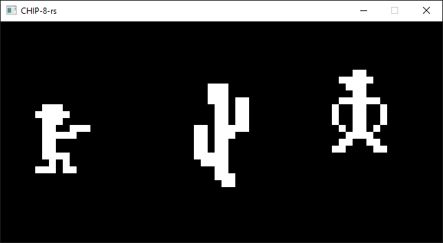

[CHIP-8](https://en.wikipedia.org/wiki/CHIP-8) emulator using [raylib](https://www.raylib.com). It expects `*.ch8` file.

```shell
cargo run -- -r foo.ch8
```

Tested with [chip8-test-suite](https://github.com/Timendus/chip8-test-suite) and few games.



Screenshot above is from the [Outlaw](https://johnearnest.github.io/chip8Archive/play.html?p=outlaw) game running on this emulator.

CHIP-8 keypad to keyboard mapping

|   |   |   |   |    |   |   |   |   |
|---|---|---|---|----|---|---|---|---|
| 1 | 2 | 3 | C | -> | 1 | 2 | 3 | 4 |
| 4 | 5 | 6 | D | -> | Q | W | E | R |
| 7 | 8 | 9 | E | -> | A | S | D | F |
| A | 0 | B | F | -> | Z | X | C | V |
